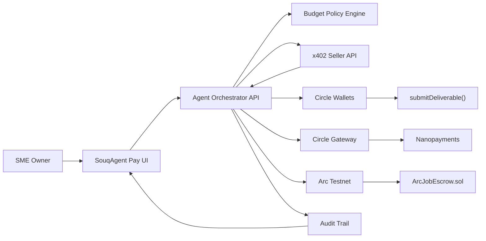

# Submission Plan

## Title

SouqAgent Pay

## Short Description

An AI spending desk for UAE/GCC SMEs where autonomous agents discover paid services, obey budget policy, execute USDC nanopayments through Circle Gateway/x402, and settle larger deliverable-based jobs with Arc escrow.

## Track

Best Agentic Economy Experience on Arc

## Circle Products Used

- USDC
- Circle Wallets
- Circle Gateway
- Nanopayments / x402
- CCTP / Bridge Kit as optional funding route

## Submission Identity

- Circle Developer Account email: `vt01nfts@gmail.com`
- Team name: `VT01`
- Team members: `VT01` solo founder-developer
- Builder bio: Solo builder creating SouqAgent Pay, an agentic stablecoin commerce product for UAE and GCC businesses, focused on AI-managed paid services, budget policy, and Arc USDC escrow settlement.
- GitHub repository: `https://github.com/Vt01nft/-SouqAgent-Pay`
- Deployment target: Vercel

## Functional MVP

Included:

- frontend dashboard;
- backend agent orchestrator;
- x402-style seller API;
- Arc USDC escrow contract deployed on Arc Testnet;
- Circle Wallet contract execution for onchain deliverable submission;
- durable Supabase task ledger and shareable receipt pages;
- owner access guard for spend and settlement controls;
- architecture section in the app;
- Circle Product Feedback documentation.

## Live Testnet Evidence

- Production app: `https://souqagent-pay.vercel.app`
- Arc Testnet USDC: `0x3600000000000000000000000000000000000000`
- ArcJobEscrow contract: `0x421707d931D0EF3b0fd4419085b91b713C622256`
- Deployment transaction: `0xcc35de9fde88a79fb7dce33051cf233a830fe007a6e4338db8a7d6e4b350fe24`
- Full flow receipt: `https://souqagent-pay.vercel.app/receipt/TASK-20260520191149`
- Production-created funded job: `6`
- Production fund transaction: `0x8749ad16ce6ff2bb6f7e5db5fb41540451bd125fb6e9185540280ffe1f41897b`
- Circle Wallet deliverable transaction id: `8c9242b3-7481-59fa-ac76-1d45ef783aa3`
- Circle Wallet deliverable tx: `0xe0d214c51edadc4f9bec75b695e08a8d3450eb2d55a1f087b2ccbc84e5e4086b`
- Release action verified on job `6`: `0xd9ebed3aae17514b3957d51c3094fdf83f0136eb19ac3627f8b4f95f28ada4fd`
- Refund action verified on job `2`: `0x87b8a818b8a79c0fb151ba2c2eba1dbde49ecad4b1b62a331fe7cb948e51d2ba`

## Architecture

## Remaining Submission Assets

- Deployed public URL
- GitHub repository URL
- Circle Developer Account email
- Demo video link
- Final presentation deck
- Optional Arc Testnet transaction hashes after deployment
