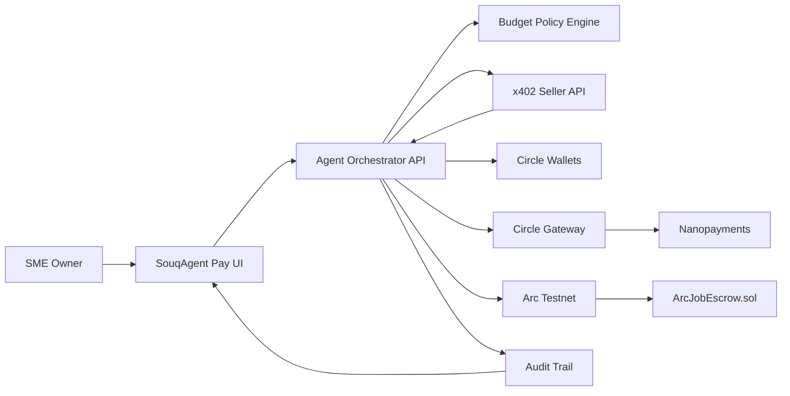

# Submission Plan

## Title

SouqAgent Pay

## Short Description

An AI spending desk for UAE/GCC SMEs where autonomous agents discover paid services, obey budget policy, execute USDC nanopayments through Circle Gateway/x402, and settle larger deliverable-based jobs with Arc escrow.

## Track

Best Agentic Economy Experience on Arc

## Circle Products Used

- USDC
- Circle Wallets
- Circle Gateway
- Nanopayments / x402
- CCTP / Bridge Kit as optional funding route

## Submission Identity

- Circle Developer Account email: `vt01nfts@gmail.com`
- Team name: `VT01`
- GitHub repository: `https://github.com/Vt01nft/-SouqAgent-Pay`
- Deployment target: Vercel

## Functional MVP

Included:

- frontend dashboard;
- backend agent orchestrator;
- x402-style seller API;
- Arc USDC escrow contract;
- architecture section in the app;
- Circle Product Feedback documentation.

## Architecture

## Remaining Submission Assets

- Deployed public URL
- GitHub repository URL
- Circle Developer Account email
- Demo video link
- Final presentation deck
- Optional Arc Testnet transaction hashes after deployment
