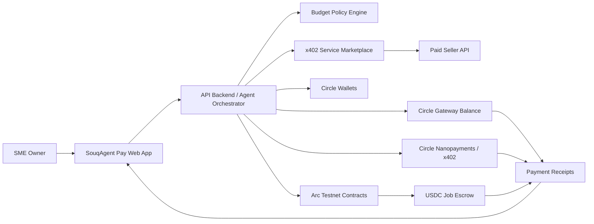

# Winning Strategy

## Positioning

SouqAgent Pay should be presented as **the control plane for business agents that spend stablecoins safely**.

The core message:

> Agents should not just recommend purchases. They should discover services, prove they are allowed to spend, pay in USDC, and leave an auditable trail a business can trust.

## Target User

UAE/GCC SME operators who need to buy small digital services frequently:

- compliance checks;
- supplier data;
- translation;
- freight quotes;
- lead enrichment;
- market reports;
- API calls from specialized providers.

These are ideal for an agentic stablecoin demo because the payments are frequent, small, programmable, and cross-border by nature.

## Judge-Facing Differentiators

- **Real agent commerce loop**: service discovery, price check, budget approval, x402 payment, data delivery, and receipt.
- **Business-grade controls**: spend caps, approved vendor list, purpose tags, and human override.
- **Arc-native settlement**: USDC-denominated contract events and deterministic finality exposed in the UX.
- **Circle-native stack**: Wallets, Gateway, Nanopayments, and optional Bridge Kit/CCTP.
- **Clear feedback section**: document what worked, where docs/access were hard, and what would make Circle products easier for builders.

## Demo Storyboard

1. Business owner funds the agent budget with test USDC.
2. Owner asks: "Find the cheapest compliant supplier-risk check for this vendor."
3. Agent evaluates two service listings.
4. Agent selects one within budget.
5. Seller API returns `402 Payment Required`.
6. Agent signs a nanopayment authorization and retries.
7. Paid supplier-risk result appears.
8. App logs receipt, policy decision, and Gateway/nanopayment status.
9. Agent creates a larger Arc escrow job for a vendor task.
10. Seller submits deliverable; agent verifies and releases USDC settlement.

## Architecture

## MVP Build Order

1. Build polished web app shell and demo data model.
2. Build backend service marketplace with one x402-protected endpoint.
3. Implement agent policy engine and purchase flow.
4. Add Circle/Gateway/Nanopayment adapter layer.
5. Add Arc escrow contract and event index display.
6. Add architecture diagram, README setup, and product feedback.
7. Record demo video and produce submission copy.

## Product Name Rationale

`SouqAgent Pay` references a market/souk without being locked to one country. It signals an agentic marketplace and payments product, while staying friendly to the UAE/GCC setting of the challenge.
